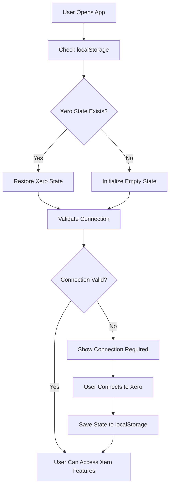

# 🔐 Centralized Xero Authentication System

## 🎯 **Overview**

The Xero authentication system has been centralized to provide a seamless, persistent authentication experience throughout the entire application. Once a user successfully logs into Xero, they can access Xero data anywhere in the app without having to reconnect each time.

## ✨ **Key Features**

### **1. Persistent Authentication State**
- **localStorage Integration** - Xero connection state is automatically saved and restored
- **Session Persistence** - Authentication persists across browser sessions
- **Automatic State Restoration** - Connection status is restored on app reload

### **2. Centralized Authentication Logic**
- **Single Source of Truth** - All Xero authentication logic is centralized in `XeroContext`
- **Consistent Behavior** - Same authentication checks across all components
- **Easy Maintenance** - Update authentication logic in one place

### **3. Reusable Components & Hooks**
- **XeroAuthGuard** - Protects components that require Xero authentication
- **useXeroAuth Hook** - Provides easy access to authentication status and helpers
- **Centralized Helpers** - Common authentication functions available everywhere

## 🏗️ **Architecture**

### **Core Components**

#### **1. XeroContext (Enhanced)**
```typescript
// Location: src/contexts/XeroContext.tsx
// Features:
- Persistent localStorage integration
- Centralized authentication state management
- Automatic state restoration
- Enhanced reducer with storage persistence
```

#### **2. XeroAuthGuard Component**
```typescript
// Location: src/components/XeroAuthGuard.tsx
// Usage:
<XeroAuthGuard>
  <YourXeroComponent />
</XeroAuthGuard>
```

#### **3. useXeroAuth Hook**
```typescript
// Location: src/hooks/useXeroAuth.ts
// Usage:
const { isXeroAuthenticated, requireXeroAuth, getStatusMessage } = useXeroAuth();
```

## 🚀 **How It Works**

### **1. Authentication Flow**



### **2. State Persistence**

```typescript
// What gets saved to localStorage:
{
  isConnected: boolean,
  hasSettings: boolean,
  selectedTenant: XeroTenant | null,
  tenants: XeroTenant[],
  lastConnectedAt: string
}
```

### **3. Authentication Checks**

```typescript
// Centralized authentication logic:
const isXeroAuthenticated = (): boolean => {
  const { isConnected, hasSettings, selectedTenant } = state;
  return Boolean(isConnected && hasSettings && selectedTenant);
};
```

## 📱 **Usage Examples**

### **1. Using XeroAuthGuard**

```typescript
import XeroAuthGuard from '../components/XeroAuthGuard';

const MyXeroComponent = () => {
  return (
    <XeroAuthGuard>
      <div>
        {/* This content only shows if user is authenticated with Xero */}
        <h1>Xero Data</h1>
        {/* Your Xero content here */}
      </div>
    </XeroAuthGuard>
  );
};
```

### **2. Using useXeroAuth Hook**

```typescript
import { useXeroAuth } from '../hooks/useXeroAuth';

const MyComponent = () => {
  const { 
    isXeroAuthenticated, 
    requireXeroAuth, 
    getStatusMessage,
    getNextAction 
  } = useXeroAuth();

  const handleLoadData = () => {
    if (!requireXeroAuth()) {
      return; // Shows error toast and returns false
    }
    
    // User is authenticated, proceed with data loading
    loadXeroData();
  };

  return (
    <div>
      <p>Status: {getStatusMessage()}</p>
      {!isXeroAuthenticated && (
        <a href={getNextAction().url}>
          {getNextAction().text}
        </a>
      )}
    </div>
  );
};
```

### **3. Manual Authentication Checks**

```typescript
import { useXero } from '../contexts/XeroContext';

const MyComponent = () => {
  const { isXeroAuthenticated, requireXeroAuth } = useXero();

  const handleAction = () => {
    // Method 1: Check and show error
    if (!requireXeroAuth()) {
      return; // Shows error toast
    }
    
    // Method 2: Silent check
    if (!isXeroAuthenticated()) {
      // Handle silently
      return;
    }
    
    // Proceed with action
  };
};
```

## 🔧 **Configuration**

### **1. Storage Keys**
```typescript
// Customizable storage keys in XeroContext.tsx
const XERO_STORAGE_KEY = 'xero_centralized_auth';
const XERO_TENANT_STORAGE_KEY = 'xero_selected_tenant';
```

### **2. Authentication Requirements**
```typescript
// XeroAuthGuard props
<XeroAuthGuard 
  requireTenant={true}        // Require tenant selection (default: true)
  showDebugInfo={false}       // Show debug information (default: false)
  fallback={<CustomFallback />} // Custom fallback component
>
```

## 🛡️ **Security Features**

### **1. Company Data Isolation**
- Each company's Xero data is completely isolated
- No cross-company data access
- Secure token management

### **2. Authentication Validation**
- Real-time connection status validation
- Automatic token refresh handling
- Secure localStorage usage

### **3. Error Handling**
- Graceful fallbacks for authentication failures
- Clear error messages for users
- Automatic retry mechanisms

## 📊 **Benefits**

### **1. For Users**
- **Seamless Experience** - No need to reconnect to Xero repeatedly
- **Persistent Sessions** - Authentication survives browser restarts
- **Clear Status** - Always know if Xero is connected
- **Quick Access** - Jump between Xero features without re-authentication

### **2. For Developers**
- **Consistent API** - Same authentication logic everywhere
- **Easy Integration** - Simple components and hooks
- **Maintainable Code** - Centralized authentication logic
- **Type Safety** - Full TypeScript support

### **3. For the Application**
- **Better Performance** - Reduced authentication overhead
- **Improved UX** - Smoother user experience
- **Reliable State** - Persistent authentication state
- **Scalable Architecture** - Easy to extend and modify

## 🔄 **Migration Guide**

### **Before (Old Way)**
```typescript
// Each component had its own authentication logic
const MyComponent = () => {
  const { isAuthenticated } = useAuth();
  const { state } = useXero();
  
  if (!isAuthenticated) {
    return <div>Please log in</div>;
  }
  
  if (!state.isConnected) {
    return <div>Please connect to Xero</div>;
  }
  
  if (!state.selectedTenant) {
    return <div>Please select organization</div>;
  }
  
  // Component content
};
```

### **After (New Way)**
```typescript
// Centralized authentication with XeroAuthGuard
const MyComponent = () => {
  return (
    <XeroAuthGuard>
      {/* Component content - only shows if authenticated */}
    </XeroAuthGuard>
  );
};

// Or with hook
const MyComponent = () => {
  const { requireXeroAuth } = useXeroAuth();
  
  const handleAction = () => {
    if (!requireXeroAuth()) return;
    // Proceed with action
  };
};
```

## 🧪 **Testing**

### **1. Authentication State Testing**
```typescript
// Test authentication state
const { isXeroAuthenticated, getStatusMessage } = useXeroAuth();
expect(isXeroAuthenticated).toBe(true);
expect(getStatusMessage()).toBe('Xero authentication complete');
```

### **2. Component Testing**
```typescript
// Test with XeroAuthGuard
render(
  <XeroAuthGuard>
    <TestComponent />
  </XeroAuthGuard>
);
```

## 🚨 **Troubleshooting**

### **Common Issues**

#### **1. Authentication Not Persisting**
- Check if localStorage is enabled
- Verify storage keys are correct
- Check for localStorage quota issues

#### **2. Components Not Showing**
- Ensure XeroAuthGuard is properly wrapping components
- Check authentication state in browser dev tools
- Verify Xero connection status

#### **3. State Not Restoring**
- Clear localStorage and reconnect
- Check for JSON parsing errors
- Verify state structure matches expected format

### **Debug Mode**
```typescript
// Enable debug mode in XeroAuthGuard
<XeroAuthGuard showDebugInfo={true}>
  <YourComponent />
</XeroAuthGuard>
```

## 🎉 **Result**

With the centralized Xero authentication system:

✅ **Users can log into Xero once and access data anywhere in the app**  
✅ **Authentication state persists across browser sessions**  
✅ **Consistent authentication behavior across all components**  
✅ **Easy to maintain and extend authentication logic**  
✅ **Better user experience with seamless Xero access**  
✅ **Type-safe and well-documented authentication system**

**The Xero authentication is now truly centralized and persistent!** 🚀


