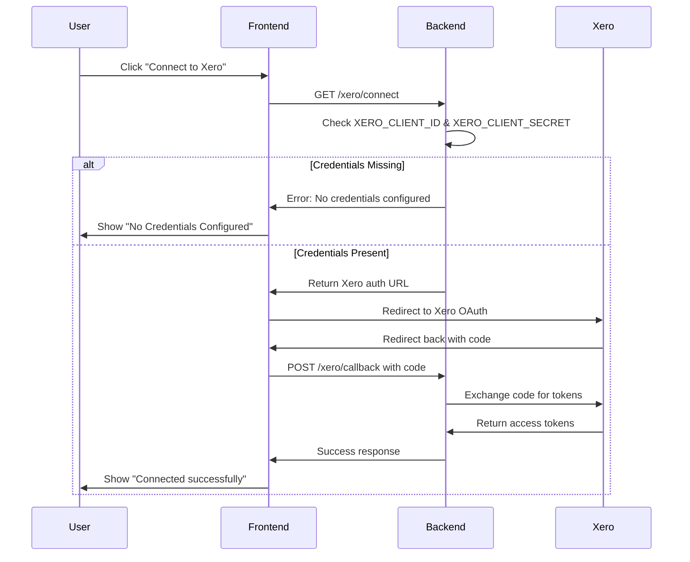

# 🔧 Xero "No Credentials Configured" Fix

## 🔍 **Root Cause**

The "No Credentials Configured" error occurs because your **backend** doesn't have the required Xero OAuth2 credentials set up. The frontend is correctly configured, but the backend needs these environment variables to enable the OAuth2 flow.

## 🛠️ **Required Backend Environment Variables**

Your backend needs these environment variables configured in your **Render backend service**:

```bash
# Xero OAuth2 Configuration (REQUIRED for backend)
XERO_CLIENT_ID=your-xero-client-id-here
XERO_CLIENT_SECRET=your-xero-client-secret-here
XERO_REDIRECT_URI=https://compliance-manager-frontend.onrender.com/redirecturl

# Alternative naming (check your backend code)
VITE_XERO_CLIENT_ID=your-xero-client-id-here
VITE_XERO_CLIENT_SECRET=your-xero-client-secret-here
```

## 📋 **Step-by-Step Solution**

### **Step 1: Get Xero OAuth2 Credentials**

1. Go to [Xero Developer Portal](https://developer.xero.com/)
2. Sign in with your Xero account
3. Click "My Apps" or "Create an App"
4. Create a new app or select existing one
5. Go to **Configuration** tab
6. Copy the following:
   - **Client ID** (e.g., `a1b2c3d4-e5f6-7890-abcd-ef1234567890`)
   - **Client Secret** (e.g., `ABC123def456ghi789...`)

### **Step 2: Set Redirect URI in Xero App**

In your Xero app configuration, add this redirect URI:
```
https://compliance-manager-frontend.onrender.com/redirecturl
```

### **Step 3: Configure Backend Environment Variables**

In your **Render Backend Service Dashboard**:

1. Go to your backend service settings
2. Navigate to **Environment** tab
3. Add these variables:

```bash
XERO_CLIENT_ID=your-actual-client-id-here
XERO_CLIENT_SECRET=your-actual-client-secret-here
XERO_REDIRECT_URI=https://compliance-manager-frontend.onrender.com/redirecturl
```

### **Step 4: Deploy Backend**

After setting the environment variables, your backend will automatically redeploy and pick up the new configuration.

## 🔄 **How the OAuth2 Flow Works**



## 🚨 **Common Issues & Solutions**

### **Issue 1: Still showing "No Credentials Configured"**
**Solution**: Check that environment variables are set correctly in backend service, not frontend.

### **Issue 2: "Invalid Client" error**
**Solution**: Verify Client ID and Secret are copied correctly from Xero Developer Portal.

### **Issue 3: "Invalid Redirect URI" error**
**Solution**: Ensure redirect URI in Xero app matches exactly:
`https://compliance-manager-frontend.onrender.com/redirecturl`

### **Issue 4: Environment variables not working**
**Solution**: Try both naming conventions:
- `XERO_CLIENT_ID` and `XERO_CLIENT_SECRET`
- `VITE_XERO_CLIENT_ID` and `VITE_XERO_CLIENT_SECRET`

## ✅ **Verification Steps**

After configuration:

1. **Check backend logs** for Xero credential loading messages
2. **Visit your frontend** - button should change from "No Credentials Configured" to "Connect to Xero"
3. **Click Connect** - should redirect to Xero authorization page
4. **Complete OAuth** - should redirect back and show success

## 🎯 **Expected Results**

After proper configuration:
- ✅ Button shows "Connect to Xero" instead of "No Credentials Configured"
- ✅ OAuth flow works properly
- ✅ Can access all Xero organizations
- ✅ Data loading works correctly

## 📞 **Need Help?**

If you're still having issues:

1. **Check backend logs** in Render dashboard
2. **Verify environment variables** are set in backend service (not frontend)
3. **Test the backend health endpoint** to see if credentials are loaded
4. **Double-check Xero app configuration** in developer portal

---

## 🔑 **Quick Reference**

**Backend Environment Variables (Required):**
```bash
XERO_CLIENT_ID=your-xero-client-id
XERO_CLIENT_SECRET=your-xero-client-secret  
XERO_REDIRECT_URI=https://compliance-manager-frontend.onrender.com/redirecturl
```

**Xero App Redirect URI:**
```
https://compliance-manager-frontend.onrender.com/redirecturl
```

The key point is that these credentials must be configured in your **backend service**, not the frontend!
